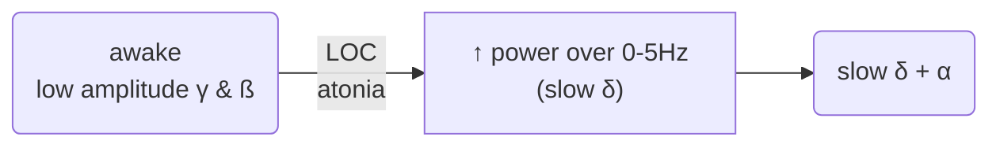
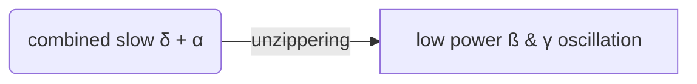

---
{"dg-publish":true,"permalink":"/Knowledge/Medicine/Bispectral index/"}
---

202208112248

Status: 

Tags: [[Knowledge/Medicine/electroencephalogram\|EEG]]

# Bispectral index

## Spectral edge frequency
The frequency (Hz) below which 95% of the EEG power resides

usually indicates GA if SEF <= 12Hz (alpha range)

Disadv
- artefact prone
- inaccurate w/ EEG suppression

Lower SEF values indicate a deeper level of anesthesia.  

However, it’s pointed out that the SEF is heavily dependent on filters applied to the raw EEG signal and it poorly reflects the center of the power spectrum distribution and the activities in the low frequency bands. It also compresses the EEG waveform into a single number, losing information on slower EEG frequencies. 

Studies have shown that SEF can correlate closely with serum concentrations of certain anesthetics like thiopental, etomidate, and fentanyl, but it can also hide shifts in EEG activity from alpha band to low frequency bands.

## Spectrogram signatures
### Propofol
> [!NOTE] High power exhibited:
> 0 - 4 Hz → Slow / delta oscillation
> 8 - 12 Hz →  Alpha oscillation

Alpha rhythms (8-12Hz) strongly couple the thalamus & cortex restricting communication

slow wave (<1Hz) rhythms create local islands preventing communication w/i the cortex

Anteriorisation is a mechanism for uncoupling the frontal & parietal parts of the brain
#### Induction

#### Emergence

### Volatiles
similar to propofol: ==slow delta & alpha== oscillations

When approaching 1 MAC:
- alpha oscillation ↓ frequency
- theta oscillation appears
→ reflecting non-GABAergic mechanism?

### Ketamine
oscillation over ==high beta / low gamma== frequency range 25-30Hz
also ==slow delta== oscillation
- less regular than that of propofol / volatile

### Dexmedetomidine
**lower** doses
- slow delta oscillations
- spindles
	- 9 - 15Hz oscillation occurring in bursts
	- closely resembles Stage 2 non-REM sleep

**higher** doses
- ↑ slow delta oscillations
- ↓ spindles
→ resemble slow wave sleep (NREM Stage 3)

## Effect of NMBA on BIS number
==B-AWAKE== trial: unreliable indicator of awareness if given [[Knowledge/Medicine/neuromuscular blocking agent\|NMBA]]

___
# References
[2024-07-11_EEG Monitoring in Anesthesia_CKChan.mp4 (sharepoint.com)](https://gocuhk-my.sharepoint.com/personal/ansoffice_cuhk_edu_hk/_layouts/15/stream.aspx?id=%2Fpersonal%2Fansoffice%5Fcuhk%5Fedu%5Fhk%2FDocuments%2FShared%20to%20Public%2FVideos%2F2024%2D07%2D11%5FEEG%20Monitoring%20in%20Anesthesia%5FCKChan%2F2024%2D07%2D11%5FEEG%20Monitoring%20in%20Anesthesia%5FCKChan%2Emp4&nav=eyJyZWZlcnJhbEluZm8iOnsicmVmZXJyYWxBcHAiOiJPbmVEcml2ZUZvckJ1c2luZXNzIiwicmVmZXJyYWxBcHBQbGF0Zm9ybSI6IldlYiIsInJlZmVycmFsTW9kZSI6InZpZXciLCJyZWZlcnJhbFZpZXciOiJNeUZpbGVzTGlua0NvcHkifX0&referrer=StreamWebApp%2EWeb&referrerScenario=AddressBarCopied%2Eview%2E8fc5afdc%2D082d%2D47e1%2D839a%2D493b50663ae1&ga=1)

[EEG for Anesthesiology - Part 3: Propofol (youtube.com)](https://www.youtube.com/watch?v=aceEqoqwugM&ab_channel=EEGforAnesthesia)

[Emery Brown (Harvard Med., MIT) 1: Unconsciousness Under General Anesthetic is a Dynamic State (youtube.com)](https://www.youtube.com/watch?v=lss9V79zn5Q&ab_channel=ScienceCommunicationLab)

[EEG Derived Monitors of General Anesthesia (youtube.com)](https://www.youtube.com/watch?v=hPbCGq7CHCk&ab_channel=WashUAnesthesiology)

[Interpretation of pEEG (youtube.com)](https://www.youtube.com/watch?v=p9pPD-CzCjI&ab_channel=LearnwithNUH)

[[Reference notes/Readwise/Articles/Response of Bispectral Index to Neuromuscular Block in Awake Volunteers†\|Response of Bispectral Index to Neuromuscular Block in Awake Volunteers† - B-AWAKE]]

