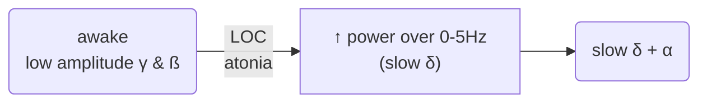
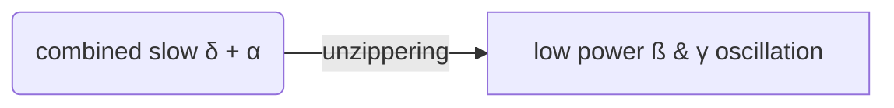

---
{"dg-publish":true,"permalink":"/Knowledge/Medicine/bispectral index/"}
---

202208112248

Status: 

Tags: [[Knowledge/Medicine/electroencephalogram\|EEG]]

# bispectral index

## Spectral edge frequency
The SEF is a measure of the frequency at which a certain percentage of the total EEG power is concentrated. 

Lower SEF values indicate a deeper level of anesthesia.  

However, it’s pointed out that the SEF is heavily dependent on filters applied to the raw EEG signal and it poorly reflects the center of the power spectrum distribution and the activities in the low frequency bands. It also compresses the EEG waveform into a single number, losing information on slower EEG frequencies. 

Studies have shown that SEF can correlate closely with serum concentrations of certain anesthetics like thiopental, etomidate, and fentanyl, but it can also hide shifts in EEG activity from alpha band to low frequency bands.

## Spectrogram patterns
### Propofol
> [!NOTE] High power exhibited:
> 0 - 4 Hz → Slow / delta oscillation
> 8 - 12 Hz →  Alpha oscillation
#### Induction

#### Emergence

Induction:
**awake** (low amplitude gamma & beta pattern) 
→ ↑power over 0 - 5 Hz (slow delta)
- correspond to LOC, atonia
→ combine slow delta + alpha pattern

___
# References
[2024-07-11_EEG Monitoring in Anesthesia_CKChan.mp4 (sharepoint.com)](https://gocuhk-my.sharepoint.com/personal/ansoffice_cuhk_edu_hk/_layouts/15/stream.aspx?id=%2Fpersonal%2Fansoffice%5Fcuhk%5Fedu%5Fhk%2FDocuments%2FShared%20to%20Public%2FVideos%2F2024%2D07%2D11%5FEEG%20Monitoring%20in%20Anesthesia%5FCKChan%2F2024%2D07%2D11%5FEEG%20Monitoring%20in%20Anesthesia%5FCKChan%2Emp4&nav=eyJyZWZlcnJhbEluZm8iOnsicmVmZXJyYWxBcHAiOiJPbmVEcml2ZUZvckJ1c2luZXNzIiwicmVmZXJyYWxBcHBQbGF0Zm9ybSI6IldlYiIsInJlZmVycmFsTW9kZSI6InZpZXciLCJyZWZlcnJhbFZpZXciOiJNeUZpbGVzTGlua0NvcHkifX0&referrer=StreamWebApp%2EWeb&referrerScenario=AddressBarCopied%2Eview%2E8fc5afdc%2D082d%2D47e1%2D839a%2D493b50663ae1&ga=1)

[EEG for Anesthesiology - Part 3: Propofol (youtube.com)](https://www.youtube.com/watch?v=aceEqoqwugM&ab_channel=EEGforAnesthesia)